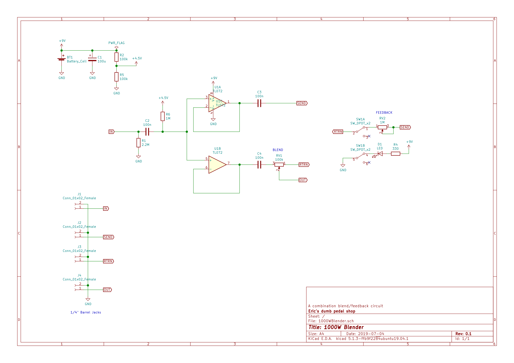

# 1000WBlender
A combination blend and feedback noise toy

## Schematic
Can be found in `assets/`

## Notes for Next Rev.

- Definitely want Linear Potentiometers for both FB and Blend.
- Both Blend and FB don't change much until the final 30% of the rotation. This
  could be played with.
- Input and Send on right side of pedal, Out and Return on left side.
- Tight Squeeze in the Enclosure!

## More Notes

- Dedicated Volume for FB? 
